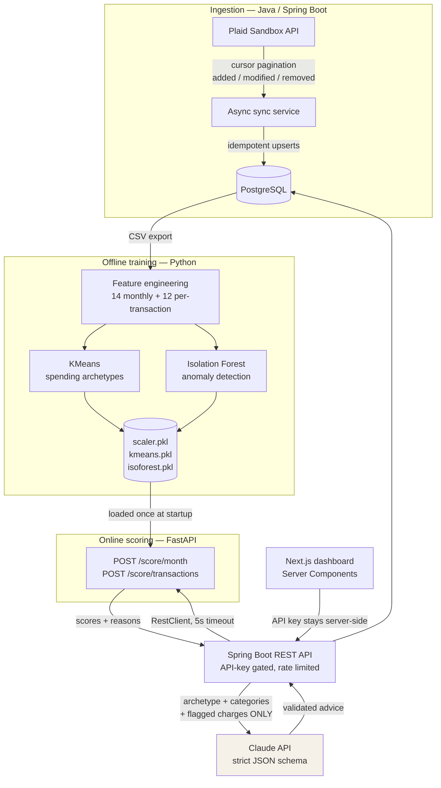

# Ledger Lens

**A financial analytics platform that models spending behavior instead of just categorizing it.**

Ingests bank transactions through the Plaid API, clusters months into human-readable spending
archetypes, and runs fraud-style anomaly detection to flag unusual charges — with a language model
strictly downstream of the deterministic ML, constrained to a JSON schema it cannot break.

```bash
git clone https://github.com/BenYang12/Personal-Spending-Analytics && cd Personal-Spending-Analytics
docker compose up -d          # then open http://localhost:3000
```

Four services, one command. New databases start empty and guide the user through Plaid Sandbox;
the synthetic portfolio dataset is available as an explicit demo mode.

---

## Why this isn't a budgeting app

Commercial budget apps **categorize**: they tell you that you spent $820 on dining. This one
**models behavior**:

- **Unsupervised clustering** assigns each account-month one of six archetypes — _Weekend Spender_,
  _Subscription Creep_, _Big-Ticket Buyer_ — from 14 behavioral features, not hand-written rules.
- **Anomaly detection** scores every transaction against _that account's own history_, so a $400
  grocery run is routine for one user and flagged for another.
- **Both models are evaluated with real numbers**, including a comparison against a simpler
  baseline that the sophisticated model does not always win.
- **The LLM decides nothing.** It receives model output and writes English about it. It cannot see
  raw transactions and cannot declare a charge anomalous.

---

## Results

### Anomaly detection — Isolation Forest vs. a statistical baseline

Measured on held-out accounts with freshly injected anomalies. Full protocol and limitations in
**[ml/EVALUATION.md](ml/EVALUATION.md)**.

| Method               | Precision | Recall    | F1        | Average precision |
| -------------------- | --------- | --------- | --------- | ----------------- |
| **Isolation Forest** | 0.645     | **0.833** | **0.727** | **0.794**         |
| z-score baseline     | 0.333     | 0.292     | 0.311     | 0.271             |

**Recall by attack type** — the table that actually matters:

| Attack pattern                                     | Isolation Forest | z-score baseline |
| -------------------------------------------------- | ---------------- | ---------------- |
| Large charge in a known category                   | 75%              | **100%**         |
| Large charge, new merchant + new category          | **100%**         | 75%              |
| Card-testing burst (several tiny charges, one day) | **81%**          | **0%**           |

The baseline **wins** on simple amount spikes — a z-score is the right tool for "one number is
large." The forest wins where weak signals have to combine. The honest production conclusion is to
run both and take the union.

### Spending archetypes — clustering, validated

k=6 chosen by silhouette analysis (0.487) over 371 account-months × 14 features.

Unsupervised learning normally offers no way to check whether clusters mean anything. Because
synthetic users were generated with _known_ archetypes, the pipeline can be scored against ground
truth:

| Metric              | Score     |
| ------------------- | --------- |
| Adjusted Rand Index | **0.986** |
| Cluster purity      | **0.994** |

---

## The dashboard

A single scrolling page, server-rendered, showing the model output in the order a person actually
asks about it: _who am I → where did it go → what looks wrong → what should I do._

| Panel                  | What it shows                                                             |
| ---------------------- | ------------------------------------------------------------------------- |
| **Spending archetype** | The cluster label plus the evidence — "78% weekend spend vs 42% typical"  |
| **Where it went**      | Category breakdown as CSS bars inside a real `<table>`                    |
| **Spending trend**     | Six months of totals, selected month highlighted                          |
| **Unusual charges**    | Flagged transactions with amounts, dates, and why they were flagged       |
| **Recurring charges**  | Detected subscriptions, led by annual cost                                |
| **Budget advice**      | Summary, three recommendations, always labeled AI-generated or rule-based |

Two product decisions worth calling out:

**Anomalies are framed as "worth reviewing," not fraud alerts.** At 0.645 precision roughly one flag
in three is a false positive. Red alarm styling would misrepresent what the model knows and train
users to distrust it, so the panel uses neutral amber and footnotes the precision.

**Advice always shows its provenance.** The badge reads _AI-generated_ or _Rule-based_ every time,
not only on failure — hiding it would imply AI authorship is the norm and conceal the fallback that
makes the feature work with no API key at all.

---

## Architecture



**Four design decisions worth defending in an interview:**

1. **Offline training / online scoring split.** Models are fit on a laptop and shipped as pickles;
   the scoring service only loads and applies them. Training never runs in a request path.

2. **One implementation of feature engineering.** The scoring service imports the exact feature code
   used for training rather than reimplementing it in Java. Two implementations of 26 feature
   definitions would drift, and the model would silently be fed unfamiliar numbers —
   _training/serving skew_, which fails without any error.

3. **Immutable events vs. derived data.** `transactions` is the source of truth and is never edited
   by analytics. `monthly_features`, `model_scores`, and `advice_cache` are derived — deletable and
   rebuildable. Model scores live in their own table so a retrain never rewrites financial records.

4. **The dashboard reads through Server Components.** The API key is used server-side and never
   reaches the browser _by construction_ — there is nothing to leak. Only the browser-initiated
   Plaid mutations go through a proxy route, which carries an endpoint allowlist.

---

## Engineering highlights

**Idempotent transaction ingestion.** Plaid's `/transactions/sync` returns `added`, `modified`, and
`removed` with cursor pagination. Re-running a completed sync returns `added: 0` — enforced by a
database `UNIQUE` constraint _and_ application-level upserts, so a bug in one layer cannot produce
duplicates.

**Graceful degradation, tested end to end.** Killing the ML service returns cached scores marked
`stale: true` in under 25ms rather than a 500. The dashboard renders every panel with honest
"Showing last known results" badges — transactions stay visible because they're facts that don't
depend on a model being up. Same for the LLM: no API key means rule-based advice, not a broken page.

**Credential handling.** Plaid access tokens live in Postgres and are provably absent from every API
response — enforced by a DTO with no such field, not by remembering to strip it.

**Cache invalidation by content, not time.** Cached advice is keyed on a SHA-256 hash of the ML
inputs it describes. A new transaction or a retrain changes the hash and the advice regenerates, so
cached advice can never describe data that no longer exists.

**Rate limiting and auth.** Every endpoint sits behind an `X-API-KEY` servlet filter using
constant-time comparison, with a bucket4j token bucket at 60 requests/minute.

---

## Run it

### Everything in Docker (recommended)

Choose one first-run path.

**Plaid-first onboarding:** copy the root environment template, add your Plaid Sandbox application
credentials, then start the stack. The application developer supplies these API credentials; end
users never do.

```bash
cp .env.example .env
# Edit .env and set PLAID_CLIENT_ID and PLAID_SECRET
docker compose up -d --build
```

Open **http://localhost:3000**, click **Connect securely with Plaid**, and use Plaid's simulated
bank credentials: `user_good` / `pass_good`. Bank authentication happens inside Plaid Link; Ledger
Lens never receives a bank username or password.

**Empty onboarding without Plaid credentials:**

```bash
docker compose up -d
```

The application still starts and displays onboarding, but the connection action reports that Plaid
is not configured.

**Synthetic portfolio demo:** opt in before the database is initialized. No Plaid credentials are
required for this mode.

```bash
LEDGERLENS_DEMO_DATA=true docker compose up -d
```

Demo mode seeds ~200 transactions containing subscriptions, weekend spikes, and one planted
$1,899 anomaly. Initialization flags apply only to a new Postgres volume. To switch an existing
local installation, run `docker compose down -v` first; this permanently deletes that local
database.

Check the running stack with `docker compose ps`. PostgreSQL, scoring, and the backend should report
healthy; the frontend should report up. Runtime logs are available with
`docker compose logs --tail=100 <service>`.

### Local development

```bash
docker compose up -d postgres              # database only

cd ml                                       # train the models
python3 -m venv .venv && .venv/bin/pip install -r requirements.txt
.venv/bin/python synthesize.py && .venv/bin/python features.py
.venv/bin/python train_clusters.py && .venv/bin/python train_anomaly.py
.venv/bin/python evaluate.py                # → ml/EVALUATION.md

cd ../scoring                               # scoring service :8000
python3 -m venv .venv && .venv/bin/pip install -r requirements.txt
.venv/bin/uvicorn app:app --port 8000

cd ../backend && ./gradlew bootRun          # API :8080

cd ../frontend                              # dashboard :3000
cp .env.example .env.local && npm install && npm run dev
```

### Demo the API directly

These account IDs and months exist in synthetic demo mode. Plaid-created account IDs depend on the
connection and should be read from `/api/accounts` first.

```bash
K='X-API-KEY: dev-local-key'

curl -i localhost:8080/api/accounts                     # 401 — auth enforced
curl -s -H "$K" localhost:8080/api/accounts             # 200 — no tokens in payload

curl -s -H "$K" 'localhost:8080/api/scores/archetype?accountId=2&month=2026-05'
curl -s -H "$K" 'localhost:8080/api/scores/anomalies?accountId=2'
curl -s -H "$K" 'localhost:8080/api/subscriptions?accountId=2'
curl -s -H "$K" 'localhost:8080/api/advice?accountId=2&month=2026-05'

# Graceful degradation: stop the scoring service, then re-run the archetype
# call. Returns stale:true with cached data instead of an error.
docker compose stop scoring
```

**Local processes without Docker.** When starting Spring from `backend/`, put `PLAID_CLIENT_ID` and
`PLAID_SECRET` in `backend/.env`; Spring imports that file relative to its working directory. Docker
Compose instead reads the repository-root `.env` described above.

**Optional — live LLM advice.** Add `ANTHROPIC_API_KEY` to the root `.env` for Docker, or to
`backend/.env` when running Spring locally. Without it the advice endpoint returns rule-based output
labeled `source: "rule-based"` — a designed path, not a failure.

---

## Deployment

Ledger Lens is currently a **single-user Plaid Sandbox portfolio application**. It is safe to deploy
as a demonstration with simulated institutions and simulated money. It is not ready to accept real
bank connections: there is no user login, tenant isolation, encrypted Plaid-token storage, webhook
processing, consent workflow, or account-deletion flow.

### Secrets and configuration

Configure these as private environment variables in the deployment platform. Do not put populated
values in Git, a Dockerfile, frontend variables, or `NEXT_PUBLIC_*` variables.

| Variable | Required | Purpose |
| --- | --- | --- |
| `LEDGERLENS_API_KEY` | Yes | Private server-to-server key shared by Next.js and Spring |
| `POSTGRES_DB` | Yes | PostgreSQL database name |
| `POSTGRES_USER` | Yes | PostgreSQL application user |
| `POSTGRES_PASSWORD` | Yes | Strong PostgreSQL password |
| `PLAID_CLIENT_ID` | For Plaid Link | Your Plaid application ID, supplied by the deployer |
| `PLAID_SECRET` | For Plaid Link | Your Plaid Sandbox secret, supplied by the deployer |
| `ANTHROPIC_API_KEY` | No | Enables LLM-written advice; rule-based advice is the fallback |
| `LEDGERLENS_DEMO_DATA` | No | Set `true` only before initializing a new demo database |

The root [.env.example](.env.example) documents every Compose variable. A root `.env` is convenient
for a private server and is Git-ignored; a managed host's encrypted secret store is preferred.

### Single-host Docker deployment

1. Install Docker Engine with Compose and place the repository on the server.
2. Configure the environment variables above through the host's secret manager or a protected root
   `.env` file.
3. Put an HTTPS reverse proxy or load balancer in front of port `3000`; do not publicly expose
   PostgreSQL (`5433`), scoring (`8000`), or Spring (`8080`).
4. Start the application with `docker compose up -d --build`.
5. Verify `docker compose ps`, `GET /actuator/health` on the backend, and the onboarding page.
6. Preserve and back up the `pgdata` volume. `docker compose down -v` permanently deletes it.

The deployer's Plaid API credentials remain server-side. A visitor only clicks **Connect securely
with Plaid**, selects a simulated institution, and authenticates within Plaid Link. For Sandbox the
standard test login is `user_good` / `pass_good`; arbitrary credentials do not work.

To support real users later, add application authentication, a user-owned Plaid Item/account model,
authorization on every data endpoint, encrypted access tokens, webhooks, disconnect and deletion
controls, production secret management, and Plaid Production approval before changing environments.

---

## API surface

| Endpoint                                                          | Purpose                                                                  |
| ----------------------------------------------------------------- | ------------------------------------------------------------------------ |
| `GET /api/accounts`                                               | Accounts with transaction counts and months (credentials never included) |
| `GET /api/transactions?accountId=&month=`                         | Transactions for a month                                                 |
| `GET /api/summary?accountId=&month=`                              | Category totals                                                          |
| `GET /api/subscriptions?accountId=`                               | Detected recurring charges                                               |
| `POST /api/plaid/link-token` · `/exchange` · `/sync` · `/refresh` | Plaid link and ingestion                                                 |
| `GET /api/scores/archetype?accountId=&month=`                     | Spending archetype + evidence                                            |
| `GET /api/scores/anomalies?accountId=`                            | Flagged charges with reasons                                             |
| `GET /api/advice?accountId=&month=`                               | Budget advice (strict JSON)                                              |
| `GET /api/export/transactions.csv`                                | Snapshot for the ML pipeline                                             |
| `GET /actuator/health`                                            | Liveness (unauthenticated by design)                                     |

---

## Tech stack

| Layer           | Technology                                              |
| --------------- | ------------------------------------------------------- |
| API & ingestion | Java 21, Spring Boot 4.1, Spring Data JPA, bucket4j     |
| Database        | PostgreSQL 16                                           |
| Bank data       | Plaid API (Sandbox)                                     |
| ML pipeline     | Python, pandas, scikit-learn (KMeans, Isolation Forest) |
| Online scoring  | FastAPI, Pydantic, uvicorn                              |
| LLM             | Claude API (`claude-opus-5`), structured outputs        |
| Dashboard       | Next.js 16, React 19, TypeScript, Tailwind 4            |
| Testing         | JUnit 5, Mockito, pytest                                |
| CI              | GitHub Actions — five parallel jobs                     |

Roughly **8,100 lines**: 2,800 Java, 3,100 Python, 1,500 TypeScript, plus SQL and config.

**88 automated tests** — 36 JUnit (ingestion, scoring degradation, advice validation), 24 pytest
(scoring API contract), 28 pytest (feature engineering, causality, leakage).

---

## Honest limitations

Stated plainly because they'd come up in any technical conversation:

- **Plaid Sandbox, not real accounts.** The integration work — Link tokens, token exchange, cursor
  pagination, idempotent upserts — is identical to production. The money is not.
- **Most training data is synthetic.** Real sandbox history is 234 transactions across 27
  account-months, far too thin to fit a 14-feature, 6-cluster model. Synthetic users with known
  archetypes validate the _pipeline_; real months are then scored by the model it produces.
- **The anomalies detected are ones I designed.** Real fraud is adversarial and adapts.
- **Plaid provides dates, not timestamps**, so time-of-day — a strong fraud signal — isn't available.
- **Webhooks were cut for scope.** Refresh is manual/async rather than push-driven.
- **Rate limiting is per-process.** Two backend instances double the effective limit; a shared Redis
  bucket is the fix.
- **The subscriptions SQL has no automated test.** It uses Postgres-specific `DISTINCT ON` and
  `DATE_TRUNC`, so an H2-backed test can't run it — that needs Testcontainers. It is verified
  manually against accounts with known ground truth.
- **The recurring-charge rule differs slightly between SQL and Python.** The dashboard's query adds
  cadence and dominance checks that `ml/features.py` lacks, so the `recurring_share` feature still
  counts high-frequency habits like daily coffee. Aligning them means retraining and re-verifying
  every metric above — deliberately deferred rather than bundled into a UI change.

---

## Improvements worth making next

1. **Combine both anomaly detectors.** The evaluation shows the baseline beating the forest on
   simple amount spikes — the union would outperform either alone.
2. **Align the two recurring-charge rules** and retrain, closing the divergence noted above.
3. **Share feature code as a versioned package** rather than a path import, so training and scoring
   deploy independently.
4. **Normalize the Plaid Item model.** The sync cursor belongs on an `items` table, not duplicated
   across account rows.
5. **Redis-backed rate limiting** so limits hold across instances.
