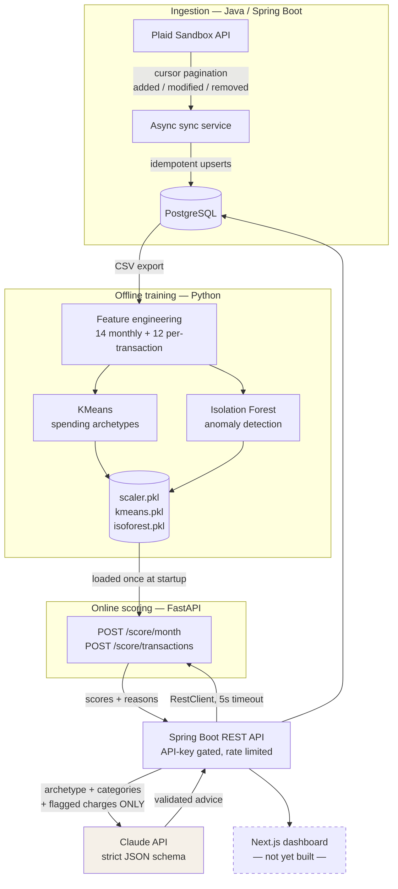

# Ledger Lens

**A financial analytics platform that models spending behavior instead of just categorizing it.**

Ingests bank transactions through the Plaid API, clusters months into human-readable spending
archetypes, and runs fraud-style anomaly detection to flag unusual charges — with a language model
strictly downstream of the deterministic ML, constrained to a JSON schema it cannot break.

> **Status: backend complete and demo-able.** All ingestion, storage, ML, scoring, and advice
> layers are built, tested, and runnable end to end. The web dashboard is the remaining work —
> see [What's next](#whats-next).

---

## Why this is different from a budgeting app

Commercial budget apps **categorize**: they tell you that you spent $820 on dining. This one
**models behavior**:

- **Unsupervised clustering** groups each account-month into one of six archetypes —
  *Weekend Spender*, *Subscription Creep*, *Big-Ticket Buyer* — derived from 14 behavioral
  features, not hand-written rules.
- **Anomaly detection** scores every transaction against *that account's own history*, so a $400
  grocery run is routine for one user and flagged for another.
- **Both models are evaluated with real numbers**, not vibes — including a comparison against a
  simpler baseline that the fancy model does not always win.
- **The LLM never decides anything.** It receives only the models' output and writes English about
  it. It cannot see raw transactions and cannot declare a charge anomalous.

---

## Results

### Anomaly detection — Isolation Forest vs. a statistical baseline

Measured on held-out accounts with freshly injected anomalies. Full protocol, limitations, and
per-attack breakdown in **[ml/EVALUATION.md](ml/EVALUATION.md)**.

| Method | Precision | Recall | F1 | Average precision |
|---|---|---|---|---|
| **Isolation Forest** | 0.645 | **0.833** | **0.727** | **0.794** |
| z-score baseline | 0.333 | 0.292 | 0.311 | 0.271 |

**Recall by attack type** — the table that actually matters:

| Attack pattern | Isolation Forest | z-score baseline |
|---|---|---|
| Large charge in a known category | 75% | **100%** |
| Large charge, new merchant + new category | **100%** | 75% |
| Card-testing burst (several tiny charges, one day) | **81%** | **0%** |

The baseline **wins** on simple amount spikes — a z-score is the right tool for "one number is
large." The forest wins where multiple weak signals have to combine. The honest production
conclusion is to run both and take the union.

### Spending archetypes — clustering, validated

k=6 chosen by silhouette analysis (0.487) over 371 account-months × 14 features.

Unsupervised learning normally gives you no way to check whether clusters mean anything. Because
synthetic users were generated with *known* archetypes, the pipeline can be scored against ground
truth:

| Metric | Score |
|---|---|
| Adjusted Rand Index | **0.986** |
| Cluster purity | **0.994** |

---

## Architecture



**Three design decisions worth defending in an interview:**

1. **Offline training / online scoring split.** Models are fit on a laptop and shipped as pickles;
   the scoring service only loads and applies them. Training never runs in a request path, and the
   API never waits on model fitting.

2. **One implementation of feature engineering.** The scoring service imports the exact feature code
   used for training rather than reimplementing it in Java. Two implementations of 26 feature
   definitions would drift, and the model would silently be fed unfamiliar numbers —
   *training/serving skew*, which fails without any error.

3. **Immutable events vs. derived data.** `transactions` is the source of truth and is never edited
   by analytics. `monthly_features`, `model_scores`, and `advice_cache` are derived — deletable and
   rebuildable at any time. Model scores live in their own table so a retrain never rewrites
   financial records.

---

## Engineering highlights

**Idempotent transaction ingestion.** Plaid's `/transactions/sync` returns `added`, `modified`, and
`removed` lists with cursor pagination. Re-running a completed sync returns `added: 0` — verified
by a database-level `UNIQUE` constraint *and* application-level upserts, so a bug in one layer
cannot produce duplicates.

**Graceful degradation, tested.** Killing the ML service mid-session returns cached scores marked
`stale: true` in **under 25ms** rather than a 500 — the transactions stay visible because they're
facts that don't depend on a model being up. Same pattern for the LLM: no API key means rule-based advice,
not a broken page.

**Credential handling.** Plaid access tokens live in Postgres and are provably absent from every API
response (enforced by a DTO with no such field, not by remembering to strip it). The frontend proxy
pattern keeps the backend API key server-side.

**Rate limiting and auth.** Every endpoint sits behind an `X-API-KEY` servlet filter using
constant-time comparison, with a bucket4j token bucket at 60 requests/minute.

**Cache invalidation by content, not time.** Cached LLM advice is keyed on a SHA-256 hash of the ML
inputs it describes. A new transaction or a retrain changes the hash and the advice regenerates —
so cached advice can never describe data that no longer exists.

---

## Run it

**Prerequisites:** Docker, JDK 21+, Python 3.11+.

```bash
# 1. Database (schema + ~200 seeded transactions with planted patterns)
docker compose up -d

# 2. ML pipeline — trains the models and writes the evaluation table
cd ml
python3 -m venv .venv && .venv/bin/pip install -r requirements.txt
.venv/bin/python synthesize.py       # 60 synthetic users, known archetypes
.venv/bin/python features.py         # behavioral feature vectors
.venv/bin/python train_clusters.py   # KMeans + archetype naming
.venv/bin/python train_anomaly.py    # Isolation Forest
.venv/bin/python evaluate.py         # → ml/EVALUATION.md

# 3. Scoring service
cd ../scoring
python3 -m venv .venv && .venv/bin/pip install -r requirements.txt
.venv/bin/uvicorn app:app --port 8000     # docs at localhost:8000/docs

# 4. Backend API
cd ../backend && ./gradlew bootRun         # localhost:8080
```

### Demo script

```bash
K='X-API-KEY: dev-local-key'

# Auth is enforced
curl -i localhost:8080/api/accounts                    # 401
curl -s -H "$K" localhost:8080/api/accounts            # 200 — no tokens in the payload

# Spending archetype for a month, with the evidence behind it
curl -s -H "$K" 'localhost:8080/api/scores/archetype?accountId=2&month=2026-05'

# Flagged transactions with human-readable reasons
curl -s -H "$K" 'localhost:8080/api/scores/anomalies?accountId=2'

# Budget advice — strict JSON, with a `source` field showing how it was produced
curl -s -H "$K" 'localhost:8080/api/advice?accountId=2&month=2026-05'

# Graceful degradation: kill the scoring service, then re-run the archetype call.
# Returns stale:true with cached data instead of an error.
```

**Optional — live Plaid sandbox.** Put `PLAID_CLIENT_ID` and `PLAID_SECRET` in `backend/.env`, then:

```bash
curl -s -X POST -H "$K" localhost:8080/api/plaid/sandbox-public-token   # mint a token
curl -s -X POST -H "$K" -H 'Content-Type: application/json' \
  -d '{"publicToken":"<token>"}' localhost:8080/api/plaid/exchange       # link accounts
curl -s -X POST -H "$K" localhost:8080/api/plaid/sync                    # ingest
curl -s -X POST -H "$K" localhost:8080/api/plaid/sync                    # added: 0 — idempotent
```

**Optional — live LLM advice.** Add `ANTHROPIC_API_KEY` to `backend/.env`. Without it the advice
endpoint returns rule-based output with `source: "rule-based"` — a designed path, not a failure.

---

## API surface

| Endpoint | Purpose |
|---|---|
| `GET /api/accounts` | Linked accounts (credentials never included) |
| `GET /api/transactions?accountId=&month=` | Transactions for a month |
| `GET /api/summary?accountId=&month=` | Category totals |
| `POST /api/plaid/link-token` · `/exchange` · `/sync` · `/refresh` | Plaid link and ingestion |
| `GET /api/scores/archetype?accountId=&month=` | Spending archetype + evidence |
| `GET /api/scores/anomalies?accountId=` | Flagged charges with reasons |
| `GET /api/advice?accountId=&month=` | Budget advice (strict JSON) |
| `GET /api/export/transactions.csv` | Snapshot for the ML pipeline |
| `GET /actuator/health` | Liveness (unauthenticated by design) |

---

## Tech stack

| Layer | Technology |
|---|---|
| API & ingestion | Java 21, Spring Boot 4.1, Spring Data JPA, bucket4j |
| Database | PostgreSQL 16 (Docker) |
| Bank data | Plaid API (Sandbox) |
| ML pipeline | Python, pandas, scikit-learn (KMeans, Isolation Forest) |
| Online scoring | FastAPI, Pydantic, uvicorn |
| LLM | Claude API (`claude-opus-5`), structured outputs |
| Testing | JUnit 5, Mockito, pytest |

**88 automated tests** — 36 JUnit (ingestion, scoring integration, degradation, advice validation),
24 pytest (scoring API contract), 28 pytest (feature engineering, causality, leakage).

---

## Honest limitations

Stated plainly because they'd come up in any technical conversation:

- **Plaid Sandbox, not real accounts.** The integration work — Link tokens, token exchange, cursor
  pagination, idempotent upserts — is identical to production. The money is not.
- **Most training data is synthetic.** Real sandbox history is 234 transactions across 27
  account-months, far too thin to fit a 14-feature, 6-cluster model. Synthetic users with known
  archetypes validate the *pipeline*; real months are then scored by the model it produces.
- **The anomalies detected are ones I designed.** Real fraud is adversarial and adapts.
- **Plaid provides dates, not timestamps**, so time-of-day — a strong fraud signal — isn't available.
- **Webhooks were cut for scope.** Refresh is manual/async rather than push-driven.
- **Rate limiting is per-process.** Running two backend instances doubles the effective limit; a
  shared Redis bucket is the fix.

---

## What's next

The backend is complete. Remaining work is presentation and deployment:

| Phase | Work | Estimate |
|---|---|---|
| **7 — Dashboard** | Next.js + TypeScript + Tailwind: Plaid Link flow, monthly overview with archetype badge and category breakdown, anomalies view, subscriptions view, advice panel. API routes proxy the backend key so the browser never sees it. Accessibility built in — text alternatives for charts, icon+text for flags (never color alone), keyboard navigation, WCAG AA contrast. | ~1–1.5 wk |
| **8 — Deploy & polish** | GitHub Actions running all 88 tests, Dockerfile for the backend, deployment to Railway/Render + Supabase + Vercel, demo GIF. | ~0.5–1 wk |

**Known improvements worth making**, in priority order:

1. **Combine both anomaly detectors.** The evaluation shows the baseline beating the forest on
   simple amount spikes — the union would outperform either alone.
2. **Share feature code as a versioned package** rather than a path import, so training and scoring
   can be deployed independently.
3. **Normalize the Plaid Item model.** The sync cursor belongs on an `items` table, not duplicated
   across account rows.
4. **Redis-backed rate limiting** so limits hold across multiple instances.
